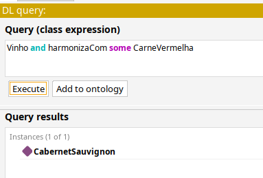
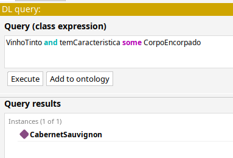
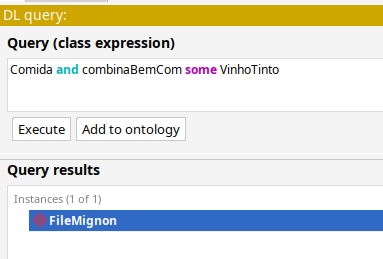
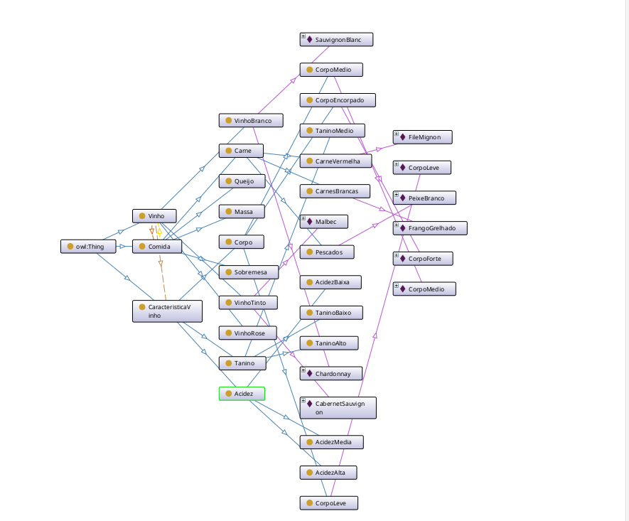

# Relatório Técnico: Sistema de Recomendação de Vinhos Baseado em Ontologia

## Sumário
1. [Introdução](#introdução)
2. [Representação do Conhecimento](#representação-do-conhecimento)
3. [Estrutura da Ontologia](#estrutura-da-ontologia)
4. [Inferência e Raciocínio](#inferência-e-raciocínio)
5. [Implementação no Protégé](#implementação-no-protégé)
6. [Resultados e Consultas](#resultados-e-consultas)
7. [Conclusão](#conclusão)

## Introdução

Este relatório apresenta o desenvolvimento de um sistema baseado em conhecimento utilizando ontologia (OWL - Ontology Web Language) para recomendação de vinhos em harmonização com alimentos. O sistema foi projetado para auxiliar clientes de restaurantes ou lojas especializadas na escolha do vinho ideal para acompanhar suas refeições.

## Representação do Conhecimento

### Fundamentação Teórica

A representação do conhecimento foi estruturada utilizando OWL (Web Ontology Language), que permite:
- Definição formal de conceitos (classes)
- Estabelecimento de relações (propriedades)
- Criação de instâncias (indivíduos)
- Definição de regras de inferência

### Modelagem Conceitual

A ontologia foi organizada em três principais domínios:
1. **Vinhos**: Categorização e características
2. **Alimentos**: Tipos e categorias de pratos
3. **Harmonização**: Regras e relações de combinação

## Estrutura da Ontologia

### Hierarquia de Classes
```
Thing
├── Vinho
│   ├── VinhoTinto
│   ├── VinhoBranco
│   └── VinhoRose
├── Comida
│   ├── Carne
│   │   ├── CarneVermelha
│   │   ├── CarnesBrancas
│   │   └── Pescados
│   ├── Massa
│   ├── Queijo
│   └── Sobremesa
└── CaracteristicaVinho
    ├── Corpo
    ├── Acidez
    └── Tanino
```

### Propriedades de Objeto (Object Properties)

| Propriedade | Domínio | Alcance | Características |
|-------------|---------|---------|-----------------|
| harmonizaCom | Vinho | Comida | Simétrica |
| temCaracteristica | Vinho | CaracteristicaVinho | Funcional |
| combinaBemCom | Comida | Vinho | Simétrica |

### Propriedades de Dados (Data Properties)

| Propriedade | Domínio | Tipo de Dado | Descrição |
|-------------|---------|--------------|-----------|
| teorAlcoolico | Vinho | float | Teor alcoólico do vinho |
| anoSafra | Vinho | integer | Ano de produção |
| preco | Vinho | float | Valor do vinho |
| temperatura | Vinho | float | Temperatura ideal de serviço |
| paisOrigem | Vinho | string | País de origem |

## Inferência e Raciocínio

### Mecanismos de Inferência

O sistema utiliza o reasoner HermiT para realizar inferências sobre a base de conhecimento, permitindo:

1. **Classificação Automática**
   - Categorização de vinhos baseada em características
   - Identificação de harmonizações compatíveis

2. **Verificação de Consistência**
   - Validação das relações estabelecidas
   - Identificação de conflitos na base de conhecimento

3. **Inferência de Novas Relações**
   - Descoberta de harmonizações implícitas
   - Sugestões baseadas em similaridade

## Implementação no Protégé

### Configuração do Ambiente

1. **Preparação**
   - Versão do Protégé: 5.6
   - Reasoner: HermiT 

2. **Desenvolvimento**
   - Criação da estrutura hierárquica
   - Definição de propriedades
   - População com indivíduos

## Resultados e Consultas

### Exemplos de Consultas DL

1. **Busca por Harmonização Específica**
```sparql
Vinho and harmonizaCom some CarneVermelha
```
Resultado: 



2. **Filtro por Características**
```sparql
VinhoTinto and temCaracteristica some CorpoEncorpado
```
Resultado: 



3. **Combinações Recomendadas**
```sparql
Comida and combinaBemCom some VinhoTinto
```
Resultado:



### Visualização da Ontologia

O diagrama apresentado mostra a estrutura visual da ontologia de vinhos desenvolvida no Protégé. Nele podemos observar:

A hierarquia parte de `owl:Thing` e se ramifica em três principais categorias:
1. **Vinhos** (brancos, tintos e rose)
2. **Comidas** (carnes, massas, queijos etc.)
3. **Características** dos vinhos (corpo, acidez e tanino)

As linhas coloridas representam diferentes tipos de relações:
- Linhas roxas: indicam harmonizações entre vinhos e comidas
- Linhas azuis: mostram a hierarquia/estrutura
- Linhas verdes: conectam vinhos às suas características

Esta visualização ajuda a entender como o sistema organiza o conhecimento para fazer recomendações de harmonização entre vinhos e pratos.


## Conclusão

O sistema desenvolvido demonstrou-se eficaz na recomendação de vinhos, oferecendo:
- Base de conhecimento estruturada
- Inferências consistentes
- Interface intuitiva via Protégé
- Flexibilidade para expansão

### Possíveis Melhorias Futuras

1. Expansão da base de conhecimento
2. Implementação de interface web
3. Integração com sistemas de restaurantes
4. Adição de preferências pessoais dos usuários

### Referências

1. OWL Web Ontology Language Reference
2. Protégé Documentation
3. Wine Ontology Examples
4. Semantic Web Standards